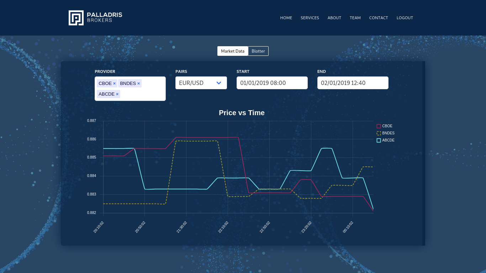

# Palladris Coded Mockup Prototype



## Overview

The goal of this project is to complete de Brick Abode front-end coded challenge. I've received some prints of how Palladris app prototype should look like and based on that I should implement my own solution.

## Stack

[React][2]
[Typescript][3]
[ReactRouter][4]
[Charts][5]
[Bloomer][6]
[Bulma][7]
[Sass][8]

## Run in the browser

It's not possible yet. It will soon be deployed

## Run Locally

You will need to have npm & node installed in your machine in order to run this app. If you will have thoses, just follow the next steps 

### Clone Repo

```bash
git clone https://gitlab.com/reedlex98/palladris-coded-mockup-prototype.git
cd palladris-coded-mockup-prototype
npm install
```

### Run The App For Development

```bash
npm start
```

### Run for Production

```bash
npm run build && npm start
```

[1]: https://chingu.io/ 'Chingu'
[2]: https://reedlex98.github.io/mapbox-tier2-prework-project/ 'click right here'


[2]: https://reactjs.org/ 'React'
[3]: https://www.typescriptlang.org/ 'Typescript'
[4]: https://www.npmjs.com/package/react-router-dom 'React Router'
[5]: https://www.chartjs.org/ 'Charts'
[6]: https://bloomer.js.org/ 'Bloomer'
[7]: https://bulma.io/ 'Bulma'
[8]: https://sass-lang.com/ 'Sass'